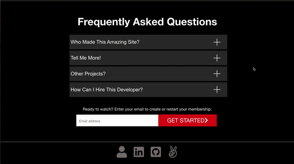

<div align="center">
  <a href="https://fauxflix.herokuapp.com/#/">Live Site</a>
</div>


# Technologies

The backend of Fauxflix is implemented using the Ruby on Rails framework with a PostGreSQL database, while the frontend is managed using the React and Redux libraries of Javascript to manage state and pass important information to child components. The app also uses the FontAwesome and Swiper libraries for icons and the genre carousel. It is styled with SCSS while the thumbnails and videos are hosted on Amazon AWS.

# Key Features

## User Authentication

<p align="center">
  
</p>

Signing up and logging in from the splash page takes users to two distinct pages with different styling. If a user adds their email on the splash page and clicks "GET STARTED", that info is passed through as a URL parameter and prefills the email input section with React state. The Rails backend handles all validations and passes any error messages to the frontend to help the user complete the process. A user's password is then salted and hashed by BCrypt to either create their password digest which is then stored in the PostGres database (sign up), or compared with an existing password digest (log in). Upon successful login or signup, React Router grants the user access to all of Fauxflix's protected routes. A user can log out by hovering over the profile pic and clicking "Log Out."

## Display Videos by Genre

<p align="center">
  
</p>

All videos and their accompanying thumbnails are stored on Amazon AWS and passed to components using Fauxflix's Redux store. On the homepage below the banner video, all FauxFlix videos are displayed by Genre in a clickable (and now swipeable!) carousel from Swiper. The carousel has navigation buttons that appear on hover on both ends to allow the user to easily click through the videos in that genre. If a user reaches the end of that list, the carousel creates clones of the previous videos and keeps going. If a user hovers over a specific video, it expands to display the description, automatically plays, and gives the user the ability to unmute, play, or add it to their list by clicking the appropriate icons.

## My List

<p align="center">
  
</p>

The My List and Search features use a similar layout. If a user adds a video to their list, that video ID is stored in the rails backend and will be displayed in the My List page so the user can keep track of their favorite videos. 

If a user expands the search input bar by clicking on the spyglass in the Navi, they can search the Fauxflix video database by a video's title and description. 

All the same functionality of the videos in the carousel is available in the videos displayed in these two pages (add/remove from My List, expanded description on hover, mute/unmute, play).


# Challenges

## Play Video on Hover

As you hover over each video tile, you'll notice it expands to display the video description and automatically plays the video. The former part was easy to manage with SCSS, but the latter required some out of the box thinking with React createRef (or useRef in React Hooks). I needed a way to refer to each specific video on MouseEnter and on MouseLeave, but regular DOM manipulation couldn't cut it.

```JavaScript 
constructor(props) {
  super(props)
  this.videoElement = React.createRef();
```
```JavaScript
<div className="videoSlideContainer" 
  onMouseEnter={this.playVideo} 
  onMouseLeave={this.stopVideo}
  ref={this.videoContainer}>
  <Link to={`/videos/${this.props.video.id}`}>
      <video 
          ref={this.videoElement}
          loop={true}
          muted={true}
          poster={this.props.video.thumbnail} 
          src={this.props.video.video} 
          className="carouselVideo" />
  </Link>
```

## Styling Genre Carousels

Everything about the Swiper API carousel excited me: it can be used with touch controls or a regular mouse, it automatically creates virtual clones of your items if you reach the end, it lazy loads everything, it looks clean, and it has good documentation. Unfortunately, it gave me buggy behavior when I imported it. Eventually, I found out the React compiler was getting confused by the style page I wrote and the styles in the swiper component. To solve this, I moved all the files together and leveraged the superior targeting ability of SCSS to transform everything into the Netflix style. 

```JavaScript 
.carousel {
        
    p {
        color: #e5e5e5;
        font-size: 24px;
        font-weight: 500;
        padding: 2rem 0 .5rem .5rem;
    }
        
    .swiper-container {
        width: 100%;
        height: fit-content;
        position: relative;
        z-index: 0;
        padding: 0 2.5vw 0 2.5vw;

        .swiper-button-prev, 
        .swiper-button-next {
            font-family: swiper-icons;
            color: white;
            height: 11vw;
            width: 70px;
            position: absolute;
            text-decoration: none;
            text-align: center;
            top: 0;
            z-index: 4;
            opacity: 0;
            transition: .2s;
        }
        
        .swiper-button-prev {
            left: 0;
        
            &:after {
                content: 'prev';
                font-size: 30px;
            }

            &:hover {
                background: rgba(0, 0, 0, .5);
                font-size: 40px;
            }
        }
        
        .swiper-button-next {
            right: 0;
        
            &:after {
                content: 'next';
                font-size: 30px;
            }

            &:hover {
                background: rgba(0, 0, 0, .5);
                font-size: 40px;
            }
        }
}
```

## Dynamic Navi Background on Homepage

I had a tough time mimicking the Netflix navi bar. On the homepage, its background changes from a slight black gradient to solid black after you scroll 50 pixels down, then reverts to a gradient when you scroll back up. I managed to get this functionality by adding an event listener and adjusting React state. In the navi component's HTML, I conditionally add "active" to the component's className so the SCSS can change the background color.

```JavaScript
handleScroll() {
    if (window.scrollY > 50) {
        this.setState({ background: true });
    } else {
        this.setState({ background: false });
    }
}

componentDidMount() {
    if (this.props.homepage) {
        window.addEventListener("scroll", this.handleScroll);
    }
}

componentWillUnmount() {
    if (this.props.homepage) {
        window.removeEventListener("scroll", this.handleScroll);
    }
}
```

```JavaScript 
 <header className={`pageHeader loggedIn ${this.state.background ? "active" : ""}`}>
```

# Future Features

* Modal to display detailed video information on click before video show page
* Cache videos to reduce pull on Amazon AWS
* Make mobile friendly
* Currently, only the banner video and genre carousels use React hooks. I'd like to update all components to use them.
